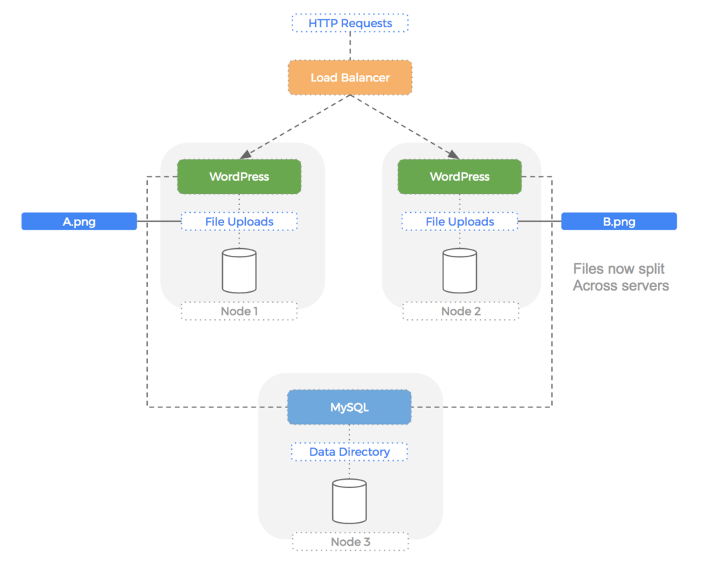

<h1 align="center">WordPress Operator</h1>

### Overview:

WordPress is one of the most versatile open source content management systems on the market. WordPress is built for high performance and is scalable to many servers, has easy integration via REST, JSON, SOAP and other formats, and features a whopping 15,000 plugins to extend and customize the application for just about any type of website.

### WordPress Bitnami Chart's features are as follows:

WordPress Bitnami Chart bootstraps a deployment on a cluster using the  package manager.
It also packages MariaDB deployment for the database requirements of the WordPress application.

In this tutorial, we’ll use Helm for setting up WordPress on top of a Kubernetes cluster, in order to create a highly-available website.
In addition to leveraging the intrinsic scalability and high availability aspects of Kubernetes, this setup will help keeping WordPress secure by providing simplified upgrade and rollback workflows via Helm.

### WordPress Architecture

In below architectural diagram, the PHP application will serve incoming HTTP requests, reads/writes are made to the file upload directory and queries are made against the backend MySQL database.

A high level WordPress Architectural flow of multi node installation of WordPress without Kubernetes or Portworx is shown below :

### Objective of tutorial

In this tutorial,we are going to cover following topics:

- How to Install WordPress Bitnami Helm Chart and verify its successful installation.
- Verify status of pods and services. 
- Configurable parameters of the WordPress Bitnami Helm Chart and their default values.
- How to access WordPress Console
- Uninstall WordPress Helm Chart and release resources

